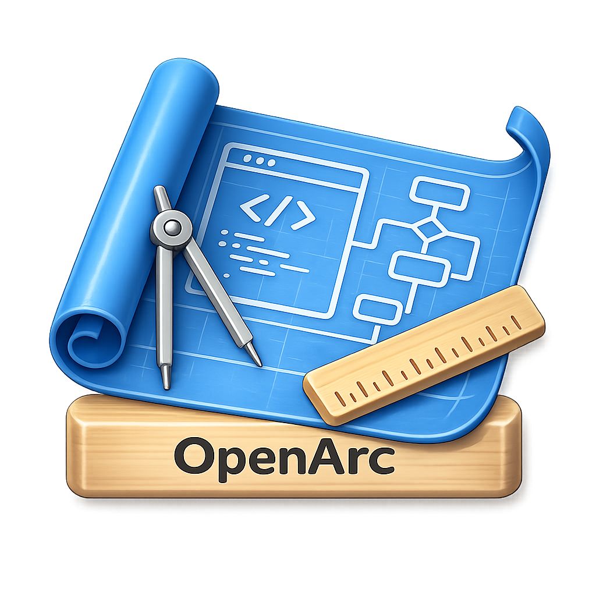
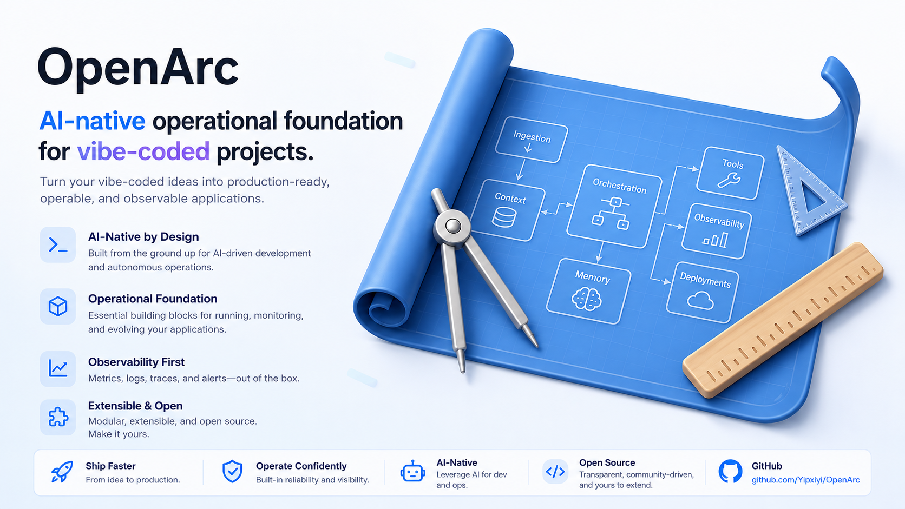

<p align="center">
  
</p>

<h1 align="center">OpenArc</h1>

<p align="center">
  面向 AI 编程助手的仓库记忆与轻量治理框架。
</p>

<p align="center">
  <a href="README.md"><strong>English</strong></a>
</p>

<p align="center">
  <a href="https://github.com/Yipxiyi/OpenArc/releases/latest"></a>
  <a href="https://github.com/Yipxiyi/OpenArc/actions/workflows/ci.yml"></a>
  <a href="LICENSE"></a>
</p>

OpenArc 由一组 agent skills、模板和无外部依赖的仓库扫描脚本组成。它帮助 Codex、Claude Code、Cursor 把项目意图保存在普通仓库文件中，而不是依赖难以追溯的旧聊天记录。

OpenArc 不是另一个编程 agent，也不是后台自动写文档的机器人，更不会要求每个项目先创建完整文档树。日常改动可以直接实现；只有确实承载决策或协作需要时，才增加持久文档。

## 为什么使用 OpenArc？

OpenArc 适合这些场景：

- 多个 agent、工具或会话需要共享同一份项目上下文；
- 产品、架构、设计或发布决策需要跨迭代保留；
- AI 构建的仓库开始出现约定漂移或重复实现；
- 希望保留项目记忆，但不想引入重型流程。

## 两分钟快速开始

### 1. 获取 OpenArc

```bash
git clone https://github.com/Yipxiyi/OpenArc.git
cd OpenArc
python3 scripts/openarc.py doctor .
```

最后一条命令输出 `OpenArc doctor: PASS`，表示插件包校验成功。

选择使用平台：

| 工具 | 最短本地路径 | 详细说明 |
| --- | --- | --- |
| Codex | 配置本地 marketplace，再安装 `openarc@local-codex-plugins`。 | [Codex 安装](docs/INSTALL.md#codex) |
| Claude Code | 运行 `claude --plugin-dir .`，仅在当前会话加载。 | [Claude Code](docs/INSTALL.md#claude-code) |
| Cursor | 使用 `cp -n` 复制项目规则，避免覆盖已有文件。 | [Cursor](docs/INSTALL.md#cursor) |

当前 Codex 使用本地 marketplace 安装。首次安装、已有 marketplace 和升级流程见 [安装指南](docs/INSTALL.md)。

### 2. 从只读审计开始

对编程助手说：

```text
使用 OpenArc 对当前仓库做只读审计。
报告仓库类型、必须补齐的缺口，以及唯一一个最小下一步。
不要创建或修改文件。
```

首次运行成功时，应得到：

- 仓库类型；
- `required`、`relevant`、`optional` 三类治理项；
- agent 识别出的冲突或高风险假设；
- 一个最小下一步。

扫描脚本只负责文件与仓库类型盘点；语义层面的漂移仍需要 agent 判断。

### 3. 只应用真正需要的改动

确定需要写入后，再明确要求：

```text
应用 OpenArc 对这个仓库的建议设置。
保留已有约定，并保持最小 diff。
```

审计、复核、扫描和“缺什么”默认只读。初始化、修复、迁移、实现、发布等操作，必须有对应的用户授权。

<p align="center">
  
</p>

## OpenArc 如何工作

1. **检查仓库**：识别仓库类型、已有约定和事实来源。
2. **选择最小路径**：直接实现、spec、plan 或活跃任务。
3. **保留必要决策**：只把真正需要跨会话保留的信息写入仓库，并验证结果。

### 交付路径

| 路径 | 适用场景 | 持久产物 |
| --- | --- | --- |
| Direct | 范围和验证清楚，风险属于日常级别。 | 无强制产物 |
| Spec | 行为、验收标准或兼容性需要持久合同。 | `docs/specs/*.md` |
| Plan | 执行顺序、迁移、回滚或验证需要结构。 | `docs/plans/*.md` |
| Tasks | 工作跨多个活跃阶段、人员或 agent。 | `docs/TASKS.md` |

这些路径彼此独立，一次变更不需要依次经过所有文档。

### 澄清关卡

对于宽泛或高风险工作，OpenArc 只询问零到五个会影响结果的关键问题。仓库证据充分时不提问；工作已经就绪且获得实现授权时，同一轮直接继续。

## 仓库模型

OpenArc 优先遵循已有仓库约定。以下标准路径只在相应治理确实需要时使用：

- `AGENT.md` 或 `AGENTS.md`：agent 协作说明；
- `docs/PROJECT_BRIEF.md`：长期项目意图；
- `docs/CODE_STYLE.md`、`docs/ARCHITECTURE.md`：实现约定；
- `docs/PRD.md`、`docs/DESIGN.md`、`docs/BRAND.md`：按需启用、彼此独立的治理文档；
- `docs/specs/*.md`、`docs/plans/*.md`、`docs/TASKS.md`：交付信息；
- `docs/CHANGELOG_AI.md`、`docs/archive/`：需要项目记忆时使用。

无法识别类型的仓库，最低只要求 README 和一个 agent guide。可选治理项缺失，不会自动让仓库变成不健康。

仓库类型、扫描等级、标准路径、skill 分组、模板和包结构见 [框架参考](docs/REFERENCE.md)。

## 示例请求

```text
使用 OpenArc 扫描当前仓库，并告诉我唯一一个最小下一步。
对这个高风险迁移运行 OpenArc clarification-gate。
为这次行为变更创建一份轻量 spec。
为这次迁移制定包含回滚和验证的计划。
在不破坏已有约定的前提下，把工作区迁移到 OpenArc。
```

## 与其他工具的关系

OpenArc 关注可长期保留的仓库上下文。Superpowers 等 agent 工作流工具更关注单次开发会话中的执行纪律；GitHub Spec Kit 等 spec-first 工具更关注功能交付。它们可以配合使用。

## 文档

- [安装指南](docs/INSTALL.md)
- [框架参考](docs/REFERENCE.md)
- [示例](examples/)
- [参与贡献](CONTRIBUTING.md)
- [变更记录](CHANGELOG.md)
- [发布版本](https://github.com/Yipxiyi/OpenArc/releases)

## 参与贡献

贡献应该改善 agent 行为，而不是为了流程本身增加流程。提交 PR 前运行：

```bash
python3 scripts/openarc.py doctor .
python3 -m unittest discover -s tests -v
```

skill、版本、校验和发布规则见 [CONTRIBUTING.md](CONTRIBUTING.md)。

## 许可证

OpenArc 使用 [MIT License](LICENSE)。
